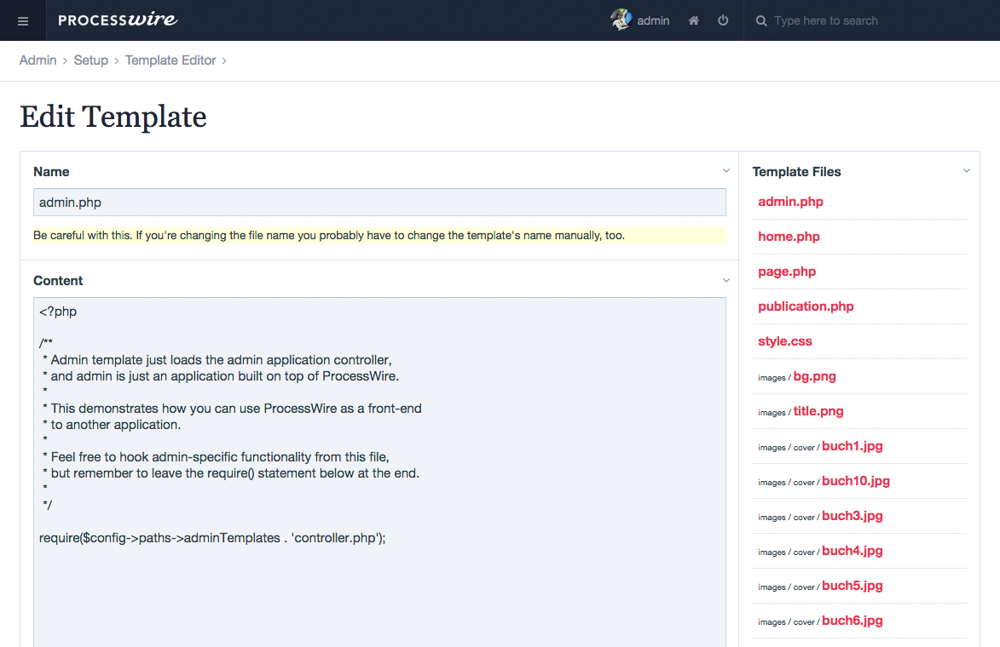

# ProcessTemplateEditor

**This module let's you edit template files and preview assets in the templates folder directly in the backend.**

*For ProcessWire 2.5+*

This module adds a new page as child of setup called "Template Editor". It allows you to change text files and preview image, audio and video files. Additionally it has "tab" support so it's easier for you to change your codes.

A nice addition for this module is [AdminHotKeys](http://processwire.com/talk/topic/1524-admin-hot-keys/) which allows you e.g. to use CTRL+S for saving the file.

## Todo (until 2.0.0)
- add new file
- show URLs to files